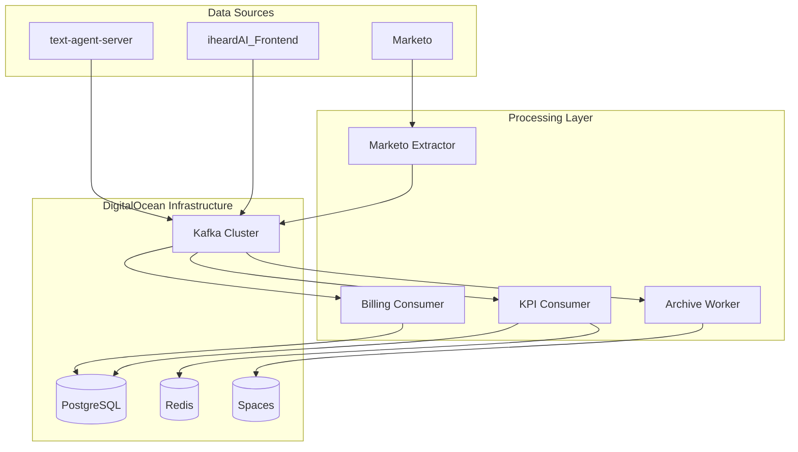

# 🚀 iheardAI Data Pipeline

[](https://opensource.org/licenses/MIT)
[](https://www.python.org/downloads/)
[](https://www.docker.com/)
[](https://kubernetes.io/)

A comprehensive, production-ready data pipeline specifically designed for **iheardAI** platform, integrating seamlessly with `iheardAI_Frontend` and `text-agent-server` components.

## 🏗️ Architecture Overview



## ✨ Features

### 🔄 **Real-time Data Processing**
- **Event Streaming**: Kafka-based architecture with sub-second processing
- **Hot Session State**: Redis-powered session management with <10ms response times  
- **Auto-scaling**: Kubernetes-native scaling based on load and consumer lag

### 📊 **Analytics & KPIs**
- **User Interaction Tracking**: Comprehensive frontend event capture
- **Conversation Analytics**: Turn completions, tool usage, and response metrics
- **Lead Management**: Marketo integration with automated data synchronization
- **Billing & Usage**: Token-based metering and account usage tracking

### 🛡️ **Security & Compliance**
- **PII Redaction**: Automatic personally identifiable information filtering
- **VPC Isolation**: Private network architecture with no public database exposure
- **Encryption**: TLS/SSL encryption for all data in transit and at rest
- **Access Control**: Role-based authentication and service-specific permissions

### 📈 **Monitoring & Observability**
- **Prometheus Metrics**: Comprehensive metrics collection for all components
- **Grafana Dashboards**: Real-time visualization and alerting
- **Structured Logging**: JSON-formatted logs with distributed tracing
- **Health Checks**: Automated health monitoring with restart policies

## 🚀 Quick Start

### Prerequisites
- Docker & Docker Compose
- Python 3.11+
- Git

### 1. Clone Repository
```bash
git clone https://github.com/your-org/iheardai-data-pipeline.git
cd iheardai-data-pipeline
```

### 2. Environment Setup
```bash
# Copy environment template
cp config/secrets.env.example config/.env

# Edit with your configuration
nano config/.env
```

### 3. Local Development
```bash
# Start all services with local databases
docker-compose --profile dev up -d

# Check service health
docker-compose ps
curl http://localhost:8000/health
```

### 4. View Monitoring
- **Grafana**: http://localhost:3000 (admin/admin)
- **Prometheus**: http://localhost:9090
- **Pipeline Status**: http://localhost:8000/status

## 📁 Project Structure

```
iheardai-data-pipeline/
├── 📂 config/              # Configuration files
│   ├── config.yaml         # Main pipeline configuration
│   ├── secrets.env.example # Environment variables template
│   └── environment.yml     # Conda environment
│
├── 📂 etl/                 # ETL Components
│   ├── extract/           # Data extractors
│   │   ├── marketo_extractor.py
│   │   ├── frontend_events_extractor.py
│   │   └── text_agent_events_extractor.py
│   ├── transform/         # Data transformations
│   └── load/              # Data loaders
│       ├── kpi_consumer.py
│       ├── billing_consumer.py
│       └── archive_worker.py
│
├── 📂 pipelines/          # Orchestration
│   └── orchestrator.py   # Main pipeline coordinator
│
├── 📂 src/               # Source code
│   ├── data/             # Data processing modules
│   ├── utils/            # Utility functions
│   │   └── monitoring.py # Monitoring & observability
│   └── validation/       # Data validation
│
├── 📂 k8s/               # Kubernetes manifests
├── 📂 helm/              # Helm charts
├── 📂 monitoring/        # Monitoring configuration
├── 📂 scripts/           # Setup and utility scripts
├── 📂 tests/             # Test suites
└── 📂 docs/              # Documentation
    └── architecture.md   # Detailed system architecture
```

## 🔧 Configuration

### Core Services Configuration

#### Kafka Topics
```yaml
topics:
  text_agent_turn_completed:
    partitions: 6
    retention: 30 days
    
  frontend_user_interaction:
    partitions: 8
    retention: 30 days
    
  marketo_leads_delta:
    partitions: 3
    retention: 7 days
```

#### Database Schema
```sql
-- Agent conversation turns
CREATE TABLE agent_turns (
    session_id TEXT,
    turn_id TEXT,
    user_id TEXT,
    channel TEXT,
    model TEXT,
    tokens_in INT,
    tokens_out INT,
    latency_ms DOUBLE PRECISION,
    response_text TEXT,
    ts_ms BIGINT,
    PRIMARY KEY (session_id, turn_id)
);

-- Session-level KPIs
CREATE TABLE session_kpis (
    session_id TEXT PRIMARY KEY,
    user_id TEXT,
    turns INT,
    tokens_in BIGINT,
    tokens_out BIGINT,
    avg_latency_ms DOUBLE PRECISION,
    started_at TIMESTAMPTZ,
    ended_at TIMESTAMPTZ
);
```

### Environment Variables

```bash
# Kafka Configuration
KAFKA_USER=your_kafka_user
KAFKA_PASSWORD=your_kafka_password

# PostgreSQL
POSTGRES_HOST=your_postgres_host
POSTGRES_USER=analytics_user
POSTGRES_PASSWORD=secure_password

# Redis
REDIS_HOST=your_redis_host
REDIS_PASSWORD=redis_password

# DigitalOcean Spaces
SPACES_ACCESS_KEY=your_spaces_key
SPACES_SECRET_KEY=your_spaces_secret

# Marketo API
MARKETO_BASE_URL=https://123-ABC-456.mktorest.com
MARKETO_CLIENT_ID=your_client_id
MARKETO_CLIENT_SECRET=your_client_secret

# iheardAI Services
FRONTEND_API_URL=https://your-frontend.vercel.app
TEXT_AGENT_API_URL=https://your-text-agent.railway.app
```

## 🚢 Deployment

### DigitalOcean (Recommended)

#### 1. Infrastructure Setup
```bash
# Create DOKS cluster
doctl kubernetes cluster create iheardai-data-cluster \
  --region nyc3 --size s-4vcpu-8gb --count 3

# Create managed services
doctl databases create kafka-cluster --engine kafka --region nyc3
doctl databases create postgres-cluster --engine pg --region nyc3
doctl databases create redis-cluster --engine redis --region nyc3
```

#### 2. Deploy Pipeline
```bash
# Build and push images
./scripts/build-and-push.sh

# Deploy with Helm
helm install data-pipeline ./helm/data-pipeline \
  --namespace data-pipeline \
  --create-namespace
```

### Railway (Alternative)

```bash
# Login to Railway
railway login

# Deploy services
railway up --service kpi-consumer
railway up --service orchestrator
```

### Local Development
```bash
# Start development environment
docker-compose --profile dev up

# Run individual components
python -m etl.extract.marketo_extractor
python -m etl.load.kpi_consumer
```

## 📊 Integration Guide

### iheardAI_Frontend Integration

Add event tracking to your frontend:

```javascript
// Track user interactions
const trackEvent = async (eventData) => {
  await fetch('/api/analytics', {
    method: 'POST',
    headers: { 'Content-Type': 'application/json' },
    body: JSON.stringify({
      event_type: 'widget_interaction',
      session_id: sessionId,
      user_id: userId,
      page_url: window.location.href,
      widget_id: 'sales-assistant',
      interaction_type: eventData.type,
      timestamp: Date.now(),
      metadata: eventData
    })
  });
};

// Usage
trackEvent({ type: 'widget_open', source: 'chat_button' });
trackEvent({ type: 'message_sent', message_length: 45 });
```

### text-agent-server Integration

Add turn completion tracking:

```python
# In your agent completion handler
async def on_turn_completed(self, turn_data: dict):
    await self.analytics.track_event({
        'event_type': 'turn_completed',
        'session_id': turn_data['session_id'],
        'turn_id': turn_data['turn_id'],
        'model': turn_data['model'],
        'tokens_in': turn_data['tokens_in'],
        'tokens_out': turn_data['tokens_out'],
        'latency_ms': turn_data['latency_ms'],
        'timestamp': int(time.time() * 1000)
    })
```

## 📈 Monitoring

### Key Metrics

- **Kafka Consumer Lag**: < 1000 messages
- **Database Write Latency**: < 100ms p95
- **Redis Response Time**: < 10ms p95
- **Event Processing Rate**: 10,000+ events/minute
- **System Uptime**: 99.9%+ availability

### Dashboards

- **Pipeline Overview**: Service health, throughput, error rates
- **Kafka Metrics**: Topic lag, producer/consumer performance
- **Database Performance**: Query times, connection pools
- **Business KPIs**: Active sessions, user engagement, revenue metrics

### Alerting Rules

```yaml
alerts:
  - name: HighConsumerLag
    condition: kafka_consumer_lag > 1000
    severity: warning
    
  - name: ServiceDown
    condition: service_health_status == 0
    severity: critical
    
  - name: DatabaseSlowQuery
    condition: database_operation_duration > 1
    severity: warning
```

## 🧪 Testing

```bash
# Run full test suite
pytest tests/ -v

# Run with coverage
pytest tests/ --cov=src --cov-report=html

# Integration tests
pytest tests/integration/ -v

# Load testing
python tests/load_test.py --duration=300 --rate=1000
```

## 🤝 Contributing

1. **Fork** the repository
2. **Create** a feature branch: `git checkout -b feature/amazing-feature`
3. **Commit** changes: `git commit -m 'Add amazing feature'`
4. **Push** to branch: `git push origin feature/amazing-feature`
5. **Open** a Pull Request

### Development Setup
```bash
# Create virtual environment
python -m venv venv
source venv/bin/activate  # or `venv\Scripts\activate` on Windows

# Install dependencies
pip install -r requirements.txt
pip install -r requirements-dev.txt

# Install pre-commit hooks
pre-commit install
```

## 📝 Documentation

- **[Architecture Guide](docs/architecture.md)** - Detailed system design
- **[Deployment Guide](README_DEPLOYMENT.md)** - Production deployment
- **[API Reference](docs/api.md)** - Service endpoints and schemas
- **[Troubleshooting](docs/troubleshooting.md)** - Common issues and solutions

## 🐛 Troubleshooting

### Common Issues

#### Service Health Check Failures
```bash
# Check pod status
kubectl get pods -n data-pipeline

# View logs
kubectl logs -f deployment/kpi-consumer -n data-pipeline

# Check configuration
kubectl describe configmap pipeline-config -n data-pipeline
```

#### High Consumer Lag
```bash
# Scale consumer instances
kubectl scale deployment kpi-consumer --replicas=3 -n data-pipeline

# Check topic configuration
kafka-topics --describe --topic text.agent.turn.completed
```

#### Database Connection Issues
```bash
# Test database connectivity
kubectl run -it --rm debug --image=postgres:15 --restart=Never -- \
  psql -h $POSTGRES_HOST -U $POSTGRES_USER -d $POSTGRES_DB
```

## 📊 Performance Benchmarks

| Component | Throughput | Latency | Resource Usage |
|-----------|------------|---------|----------------|
| Marketo Extractor | 1,000 records/min | ~2s per batch | 0.5 CPU, 512MB RAM |
| Frontend Events | 50,000 events/min | <100ms | 1 CPU, 1GB RAM |
| Text Agent Events | 10,000 events/min | <50ms | 0.5 CPU, 512MB RAM |
| KPI Consumer | 20,000 events/min | <200ms | 2 CPU, 2GB RAM |
| Archive Worker | 100GB/hour | ~10min batches | 1 CPU, 2GB RAM |

## 🔒 Security

- **Network Isolation**: All services deployed in VPC
- **Encryption**: TLS 1.3 for all communications
- **Secrets Management**: Kubernetes secrets with automatic rotation
- **Access Control**: RBAC with least-privilege principles
- **Audit Logging**: Comprehensive access and operation logging
- **Vulnerability Scanning**: Automated container security scans

## 📜 License

This project is licensed under the MIT License - see the [LICENSE](LICENSE) file for details.

## 🙏 Acknowledgments

- **Kafka** for reliable event streaming
- **DigitalOcean** for managed infrastructure services
- **Prometheus & Grafana** for monitoring and observability
- **PostgreSQL** for robust data analytics storage

## 📞 Support

- **Documentation**: [docs/](docs/)
- **Issues**: [GitHub Issues](https://github.com/your-org/iheardai-data-pipeline/issues)
- **Discussions**: [GitHub Discussions](https://github.com/your-org/iheardai-data-pipeline/discussions)
- **Email**: [data-team@iheardai.com](mailto:data-team@iheardai.com)

---

**Built with ❤️ for the iheardAI Platform**