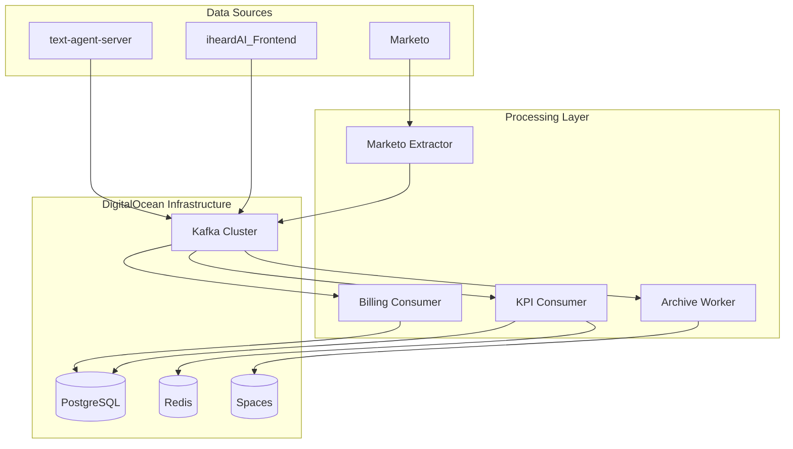

# Data Pipeline Architecture Design

## System Architecture

### High-Level Flow



## Component Integration

### iheardAI_Frontend Integration

**Event Types Produced:**
- User interaction events (clicks, form submissions)
- Session analytics data
- Widget performance metrics
- Customer engagement data

**Kafka Topics:**
- `frontend.user.interaction` - User UI interactions
- `frontend.session.analytics` - Session-level metrics
- `frontend.widget.performance` - Widget performance data

### text-agent-server Integration

**Event Types Produced:**
- Agent turn completions
- Tool invocations
- Session state changes
- Response generation metrics

**Kafka Topics:**
- `text.agent.turn.completed` - Completed conversation turns
- `agent.tool.invoked` - Tool usage events
- `text.agent.session.updated` - Session state changes

## Data Models

### PostgreSQL Schema

#### Agent Turns Table
```sql
CREATE TABLE agent_turns (
    session_id TEXT,
    turn_id TEXT,
    user_id TEXT,
    channel TEXT DEFAULT 'text',
    model TEXT,
    tokens_in INT,
    tokens_out INT,
    latency_ms DOUBLE PRECISION,
    response_text TEXT,
    ts_ms BIGINT,
    PRIMARY KEY (session_id, turn_id)
);
```

#### Frontend Analytics Table
```sql
CREATE TABLE frontend_analytics (
    event_id TEXT PRIMARY KEY,
    session_id TEXT,
    user_id TEXT,
    event_type TEXT,
    page_url TEXT,
    widget_id TEXT,
    interaction_type TEXT,
    ts_ms BIGINT,
    metadata JSONB
);
```

#### Session KPIs Table
```sql
CREATE TABLE session_kpis (
    session_id TEXT PRIMARY KEY,
    user_id TEXT,
    channel TEXT,
    turns INT,
    tokens_in BIGINT,
    tokens_out BIGINT,
    avg_latency_ms DOUBLE PRECISION,
    started_at TIMESTAMPTZ,
    ended_at TIMESTAMPTZ,
    updated_at TIMESTAMPTZ DEFAULT NOW()
);
```

### Redis Hot State Schema

```
session:{session_id}:state -> {
    "last_turn_id": "turn_123",
    "last_message": "...",
    "seq": 42,
    "updated_at": "2025-01-01T10:00:00Z",
    "channel": "text",
    "status": "active"
}

session:{session_id}:metrics -> {
    "total_turns": 5,
    "avg_response_time": 1200,
    "last_activity": "2025-01-01T10:00:00Z"
}
```

## Kafka Topic Configuration

### Topic Definitions
```yaml
topics:
  text.agent.turn.completed:
    partitions: 6
    retention.ms: 2592000000  # 30 days
    cleanup.policy: delete
    
  frontend.user.interaction:
    partitions: 8
    retention.ms: 2592000000  # 30 days
    cleanup.policy: delete
    
  agent.tool.invoked:
    partitions: 3
    retention.ms: 2592000000  # 30 days
    cleanup.policy: delete
    
  billing.usage.metered:
    partitions: 3
    retention.ms: 2592000000  # 30 days
    cleanup.policy: delete
    
  marketo.leads.delta:
    partitions: 3
    retention.ms: 604800000   # 7 days
    cleanup.policy: delete
```

## Processing Components

### 1. Frontend Event Producer
- Embedded in iheardAI_Frontend
- Captures user interactions and analytics
- Batches events for efficient Kafka production

### 2. Text Agent Producer
- Integrated with text-agent-server
- Produces turn completion and tool usage events
- Includes response metrics and performance data

### 3. KPI Consumer
- Processes all turn completion events
- Updates PostgreSQL agent_turns and session_kpis tables
- Maintains Redis hot session state

### 4. Billing Consumer
- Aggregates usage data by account and time window
- Calculates token consumption and API usage
- Updates billing_usage table for invoicing

### 5. Archive Worker
- Batch processes events to DigitalOcean Spaces
- Creates daily/hourly partitions in Parquet format
- Maintains schema evolution compatibility

## Security & Compliance

### Data Protection
- PII redaction at source producers
- Field-level encryption for sensitive data
- VPC-only network access for all data services

### Access Control
- Service-specific Kafka principals
- Topic-scoped ACLs for producers/consumers
- PostgreSQL role-based access control
- Redis AUTH and keyspace isolation

### Monitoring
- Kafka consumer lag monitoring
- Database connection pool metrics
- Redis memory and connection tracking
- Archive job success/failure alerts

## Deployment Strategy

### Infrastructure Requirements
- DigitalOcean VPC with private networking
- DOKS cluster (3-node minimum)
- Managed Kafka (3 brokers)
- Managed PostgreSQL (2+ vCPU)
- Managed Redis (small instance)
- Spaces bucket with CDN

### Service Deployment
- Kubernetes Deployments for consumers
- CronJob for Marketo extractor
- ConfigMaps for topic configuration
- Secrets for service credentials

## Performance Targets

- **Redis Response Time**: < 10ms p95
- **Kafka Consumer Lag**: < 15 minutes under peak load
- **PostgreSQL Write Latency**: < 100ms p95
- **Archive Flush Window**: Hourly batches
- **Data Retention**: 30 days operational, permanent archive